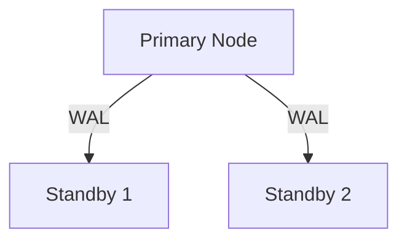
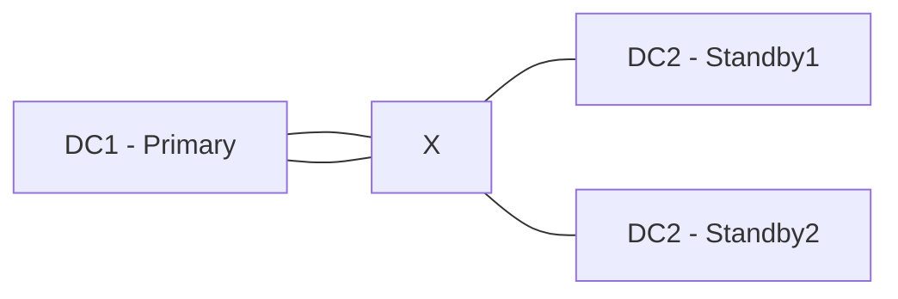

> [!info]  
> **Главное:** Теорема CAP объясняет, почему в распределённых системах нельзя одновременно добиться идеальной согласованности, доступности и устойчивости к сбоям сети. PostgreSQL в одиночном экземпляре об этом «не думает», но в кластере — думает ещё как.

---

## 🧠 Краткий конспект

- **CAP-теорема** говорит: при сбое сети система должна выбрать между доступностью и согласованностью.
- PostgreSQL сам по себе — не распределённая БД, но при репликации это становится важным.
- **Consistency** (согласованность) — важна для строгих транзакций: пример — `SERIALIZABLE`.
- **Availability** (доступность) — способность отвечать, даже при отказе: пример — Patroni-переключение.
- **Partition Tolerance** — устойчивость к разрыву связи: когда мастер и реплика не могут общаться.
- **При failover важно квормить** (большинство узлов должны «согласиться»): иначе — split-brain.
- Хорошее понимание CAP помогает избежать ошибок в проектировании кластера.

---

## Глоссарий

- **Консистентность (Consistency)** — все видят одни и те же данные.
- **Доступность (Availability)** — база отвечает, даже если часть данных временно недоступна.
- **Разделение (Partition)** — потеря связи между частями кластера.
- **Сплит-брайн (Split-brain)** — две ноды считают себя «главными».
- **Failover** — автоматическое переключение на резервный сервер.
- **Quorum (кворум)** — большинство участников кластера должны подтвердить действие.

---

## CAP-теорема простыми словами

Представь кафе. Ты можешь быстро обслуживать клиентов, давать качественную еду и держать низкие цены. Но все три сразу — сложно.

Точно так же в распределённой базе нельзя одновременно:
- Сохранять **согласованность** данных (все видят одно и то же),
- Обеспечивать **доступность** (всегда отвечаем),
- Быть **устойчивыми к разрыву связи** (например, одна часть кластера потеряла связь с другой).

> [!info]
> Теорема CAP формулирует дилемму: при сетевом разделении система должна выбрать — либо быть доступной, либо согласованной.

---

## Consistency на примере PostgreSQL

PostgreSQL поддерживает уровни изоляции транзакций. Наиболее строгий — `SERIALIZABLE`.

> [!example]
> Представь две транзакции:
>
> ```sql
> -- Транзакция 1
> BEGIN;
> SELECT COUNT(*) FROM orders WHERE status = 'pending';
> -- возвращает 5
>
> -- Транзакция 2 (параллельно)
> BEGIN;
> INSERT INTO orders (status) VALUES ('pending');
> COMMIT;
>
> -- Транзакция 1 продолжает:
> SELECT COUNT(*) FROM orders WHERE status = 'pending';
> -- снова возвращает 5? Фантом!
> COMMIT;
> ```
>
> При уровне `REPEATABLE READ` это может произойти. А при `SERIALIZABLE` — PostgreSQL откатит одну из транзакций.

> [!tip]
> Если нужен строгий контроль за параллельностью — `SERIALIZABLE` ваш друг. Но он медленнее и требует аккуратности.

---

## Availability в PostgreSQL

Один экземпляр PostgreSQL — не распределённая система. Но при репликации (например, с помощью **Patroni**) появляется избыточность.

Patroni управляет кворумом и переключением мастера.



Если `A` (мастер) упал — Patroni может перевести `B` в мастер.

> [!example]
> При падении `Primary`:
>
> 1. Standby-узлы замечают сбой.
> 2. Один из них (например, `B`) становится новым мастером.
> 3. Остальные реплики переключаются на `B`.

> [!tip]
> Доступность здесь — это способность быстро переключиться без потери доступа к данным. Но… только если всё правильно настроено.

---

## Partition Tolerance: что происходит при разрыве сети?

Рассмотрим случай: мастер PostgreSQL находится в одном дата-центре, а реплики — в другом. Между ними пропала связь.



> [!example]
> Что может пойти не так:
>
> - A всё ещё считает себя главным.
> - B и C не могут с ним связаться.
> - Patroni решает: «У нас нет кворума — делаем failover».

Теперь **два мастера**. Это называется **split-brain**.

> [!warning]
> Без quorum-контроля можно получить **рассогласование данных** — оба мастера пишут разное, а потом возникает конфликт.

---

## Нюансы и подводные камни

> [!warning]
> **Самые частые ошибки при работе с CAP и PostgreSQL:**
> 
> - Использовать `REPEATABLE READ`, думая, что это «абсолютная консистентность».
> - Не настроить quorum — и получить два мастера.
> - Отключить synchronous-репликацию в проде — и потерять записи при failover.
> - Не учитывать задержки WAL и лаг Standby.
> - Принять PostgreSQL за полноценную распределённую БД — это не так.

---

> [!faq]  
> **Q:** PostgreSQL — это CP, AP или CA?  
> **A:** В одиночной инстанции — **CA** (консистентность + доступность).  
> В кластере — скорее **CP**: предпочитает консистентность, теряя доступность при разрыве.  
>  
> **Q:** Что будет, если мастер упал, но quorum не достигнут?  
> **A:** Patroni не переключит мастера — система остановится (сохраняется консистентность).  
>  
> **Q:** Как проверить, что Standby отстаёт?  
> **A:** Используйте `pg_stat_replication` и поле `replay_lsn`.  
>  
> **Q:** Можно ли писать в Standby?  
> **A:** Нет, он только для чтения. Но можно настроить логическое реплицирование для частичных решений.  

---

## Полезные ссылки

- [CAP Theorem Explained — BMC](https://www.bmc.com/blogs/cap-theorem/?utm_source=chatgpt.com)
- [PostgreSQL Replication Guide — Kinsta](https://kinsta.com/blog/postgresql-replication/?utm_source=chatgpt.com)
- [CAP Theorem by IBM](https://www.ibm.com/think/topics/cap-theorem?utm_source=chatgpt.com)
- https://www.postgresql.org/docs/current/high-availability.html
- https://patroni.readthedocs.io/en/latest/
- [[PostgreSQL: уровни изоляции]]
